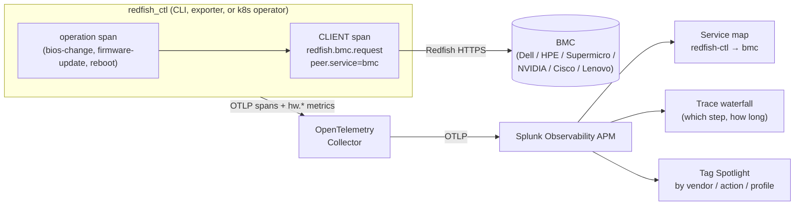

# Observability: streaming BMC operations to Splunk (and any OTLP backend)

Author: Mus <spyroot@gmail.com>

`redfish_ctl` emits OpenTelemetry **metrics** and **traces** over OTLP, so a fleet of server BMCs —
and the operations run against them — become visible in Splunk Observability APM (or any OTLP
backend: Grafana Tempo/Mimir, an OpenTelemetry Collector, etc.). No host-side daemon and no code in
the firmware; everything is read out-of-band over the Redfish API and shipped as standard telemetry.

## What problem this addresses

At fleet scale (hundreds to thousands of servers, each with a different tuning profile) a platform
team mutates BMCs constantly — tuning BIOS, upgrading firmware, setting boot order, remediating
drift — usually through a k8s operator. Without telemetry, that activity is invisible: which node's
BIOS apply failed, which vendor's firmware flash is slow, which reconcile is stuck waiting on a
reboot. `redfish_ctl` wraps command executions in operation spans and traced Redfish request helpers
in client spans, so covered activity shows up as a normal APM service map, trace waterfall, and
per-operation error/latency breakdown.

## Who it is for

- Platform / infrastructure teams operating bare-metal fleets from Kubernetes.
- SREs who already run Splunk APM (or an OTel Collector) and want bare-metal lifecycle operations in
  the same pane as their applications.
- Anyone driving BMC mutations (BIOS/firmware/boot/power) who needs to see success rate, latency, and
  the failing step across a fleet.

## How it works



Two signals, one pipeline:

- **Traces.** Each command run through the engine opens an **operation span** named by the command
  (`firmware-update`, `bios-change`, `reboot`). BMC calls routed through the manager HTTP verbs, the
  Redfish action primitive, and the firmware upload helper open `SpanKind.CLIENT` spans
  (`redfish.bmc.request`) carrying `peer.service="bmc"`. Because the BMC is uninstrumented, Splunk
  infers it as a single downstream service node — so a whole fleet renders as `redfish-ctl → bmc`, not
  one node per address. Failures set the span to ERROR (from the HTTP status or `CommandResult.error`),
  which drives the red edges, error rate, and Root Cause in APM. The public span contract lives in
  `specs/telemetry/span_contract.yaml`; the merge-gate coverage requirements live in
  `specs/telemetry/gates.md`, and the implementation is in `redfish_ctl/telemetry/tracing.py`.
- **Metrics.** The exporter samples hardware state (power, thermal, fans, GPU, leak detection, fabric)
  into the stable `hw.*` metric family. Traces say *what operation ran and whether it failed*; metrics
  say *what the hardware did* — a firmware-update span sits next to the `hw.power` spike it caused,
  correlated by node in the same tenant. See [Telemetry Exporter](telemetry-exporter.md).

At fleet scale the group-by dimensions (Splunk Tag Spotlight) stay low-cardinality on purpose —
`vendor`, `model`, `action`, `profile`, `firmware.component` are indexed; per-node identifiers
(`bmc.ip`, `node`, `task_id`) stay as searchable span attributes but are **not** indexed, to stay
within the Troubleshooting MetricSet cardinality budget.

## Quick start — stream to Splunk in three commands

Install with the OTLP extra, point at your collector (or Splunk OTLP endpoint), and run a command
with tracing on:

```bash
# 1. install with the OpenTelemetry extra
pip install "redfish-ctl[otlp]"

# 2. point at your OTLP collector / Splunk (token via env, never on argv)
export OTEL_EXPORTER_OTLP_ENDPOINT="https://<your-collector-or-ingest>:4317"
export OTEL_EXPORTER_OTLP_HEADERS="X-SF-Token=<your-splunk-access-token>"

# 3. run any operation with tracing enabled
redfish_ctl --otlp-traces system            # a read; shows redfish-ctl → bmc in the service map
redfish_ctl --otlp-traces system-reset --dry_run   # guarded reset preview; no POST
```

Within seconds the operation appears in APM: a `redfish-ctl → bmc` service map, a trace waterfall of
the BMC calls, and per-operation error/latency in Tag Spotlight. Metrics stream the same way via the
exporter:

```bash
redfish_ctl exporter --output otlp --once     # one scrape of hw.* metrics to the same endpoint
```

For a **k8s deployment** (one exporter pod per BMC, the operator reconciling profiles, all streaming
to an in-cluster Collector), see the [Kubernetes guide](../k8s/README.md) and the Helm chart under
`charts/`.

## Try it with zero hardware

The mock BMC serves the committed GB300 corpus over HTTP and can replay captured mutations, so
supported read paths and replay-backed mutation paths can be exercised with no real BMC. See
[Simulation and replay](simulation-and-replay.md).
